### 3-1. BMIシーンを追加する
BMI測定するためのシーンを追加します。左側メニューの「Main invocation」からTransition部分に `BMI` シーンを追加してください。

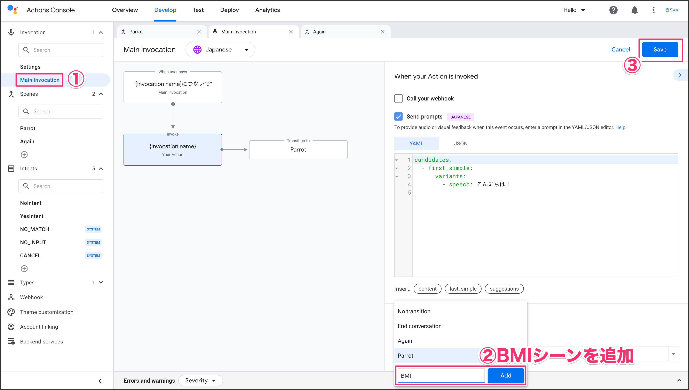

`BMI` シーンを開いて、 Slot fillingカテゴリにある［+］をクリックして、身長を格納するスロットを追加します。 Slotカテゴリに `height` という名前を入力して、プルダウンメニューから数字を格納するための `actions.type.Number` を選択します。これで数字のみ取得することができます。

`This slot is required` と `Send prompts` の2箇所チェックを入れて、YAMLファイルに「身長をセンチでお答えください。」と入力します。

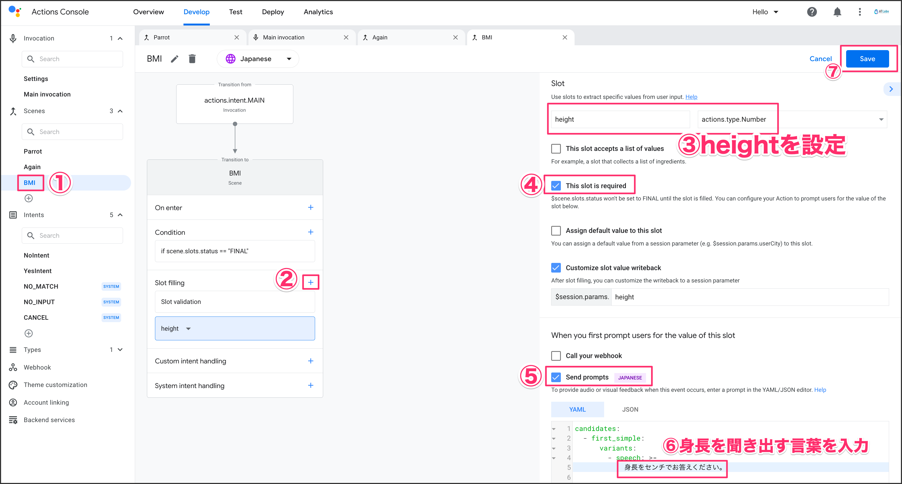

同様に体重も聞き出すために Slot fillingに追加します。体重を聞き出すための言葉も設定しておきます。

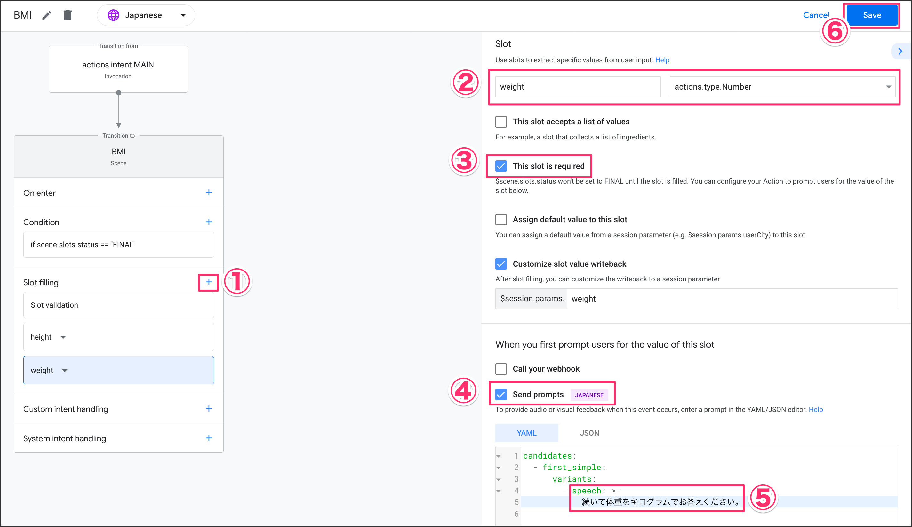

Slotが全部埋まったときに実行されるConditionの設定を行います。 `Call your webhook` のチェックを入れてから、ハンドラー名に `bmi` と入力してください。Transitionに再度BMI測定するための `Again` シーンを設定しておきます。Actions Builderのメリットは過去に作成したシーンを使い回せることです。

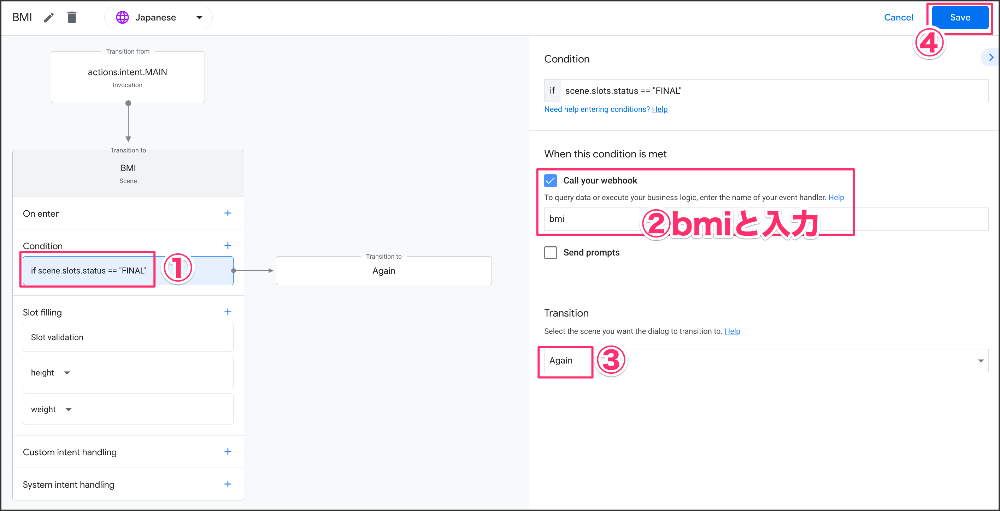

### 3-2. Webhookを設定する
BMIの掲載を行うためにWebhookを設定します。左側メニューにある「Webhook」をクリックして、表示されるポップアップは `Inline Cloud Functions` 側をクリックしてから ［Confirm］ボタンをクリックします。

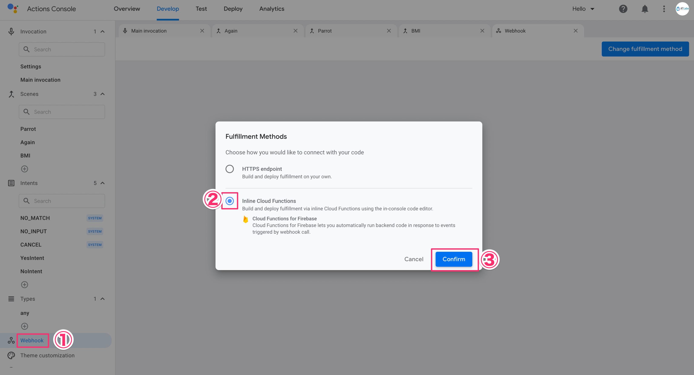

下記コードを貼り付けて、［Save Fulfillment］と［Deploy Fulfillment］ボタンをクリックします。コードのデプロイは約数分かかります。気長に待ちましょう。

<pre class="file" data-target="clipboard">
const { conversation } = require('@assistant/conversation');
const functions = require('firebase-functions');

const app = conversation();

app.handle('bmi', conv => {
	const height = conv.session.params.height;
	const weight = conv.session.params.weight;
  const bmiVal = (parseFloat(weight) / (parseFloat(height)/100 * parseFloat(height)/100)).toFixed(1);

  conv.add(`あなたのBMIは ${bmiVal} です。`);
});

exports.ActionsOnGoogleFulfillment = functions.https.onRequest(app);
</pre>

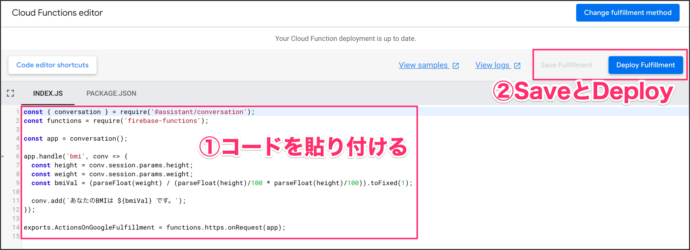

### 3-3. Againシーンを編集する
「はい」と答えたら、オウム返しのシーンに行ってしまうので、BMIシーンに行くように設定しておきます。
左側メニューからAgainシーンをクリックして、Transition部分を `BMI` シーンに変えておきます。

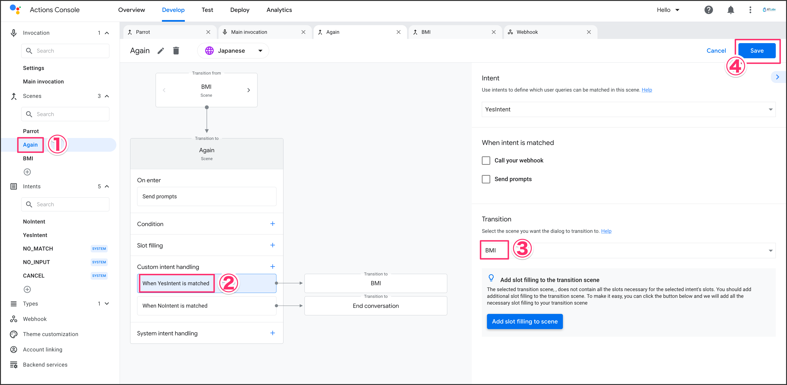

シミュレーターで確認しましょう。身長と体重の値を入力するとBMIの結果が返ってくるようになります。

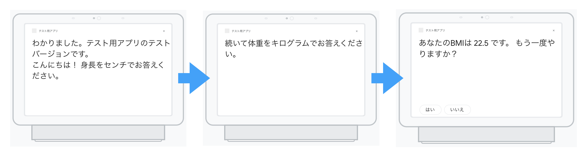

### 3-4. 外部APIと連携する
先程おこなったものはInlineエディタでFirebase Function上のプログラムで実行されていました。今回はDenoで構築した外部APIと連携して、BMI測定結果を返すように設定します。

左側メニューのWebhookから画面右上にある `Change fulfillment method` ボタンをクリックします。今度は `HTTPS endpoint` を選択して［Confirm］ボタンをクリックします。

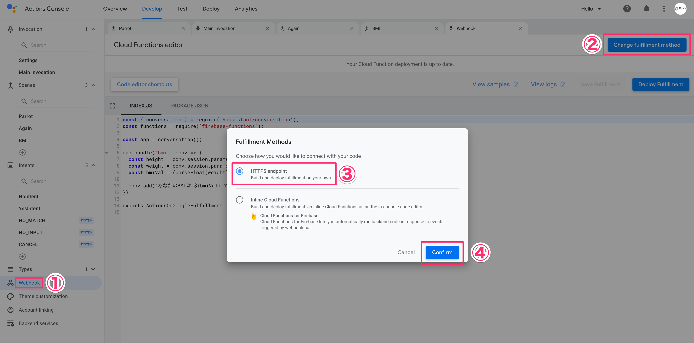

WebhookのURLは下記URLを貼り付けてください。

`https://[[HOST_SUBDOMAIN]]-3000-[[KATACODA_HOST]].environments.katacoda.com/`{{copy}}

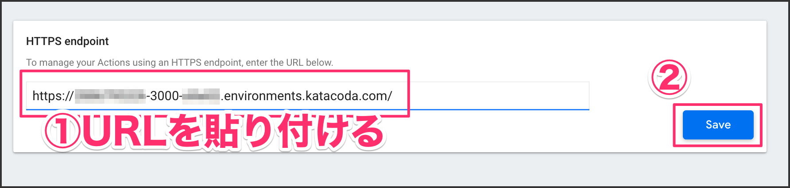

### 3-5. プログラムを設定する
IDEタブをクリックしてVSCodeを表示してください。`example/hello.ts` ファイルを開いて、下記プログラムをコピペしてください。

<pre class="file" data-target="clipboard">
import { Application, Context } from "https://deno.land/x/abc@v1.0.0-rc10/mod.ts";
const app = new Application();

app.post('/', async (ctx: Context) => {
    const { session } = await (ctx.body());
    const param = session.params;
    const bmiVal = (parseFloat(param.weight) / (parseFloat(param.height)/100 * parseFloat(param.height)/100)).toFixed(1);
    
    let js = {
        "prompt": {
            "override": false,
            "firstSimple": {
                "speech": `あなたのBMIは ${bmiVal} です。 from Deno！`,
                "text": ""
            }
        }
    }

    await ctx.json(js);

});

// ポート開く
app.start({port: 3000});
</pre>

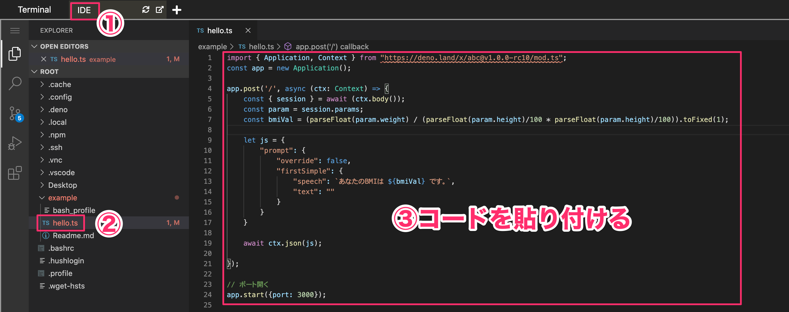

下記コマンドを実行してプログラムを起動させてください。

`deno run --allow-net hello.ts`{{execute}}

シミュレーターで再度実行するとDenoから結果が返ってくることが確認できます。

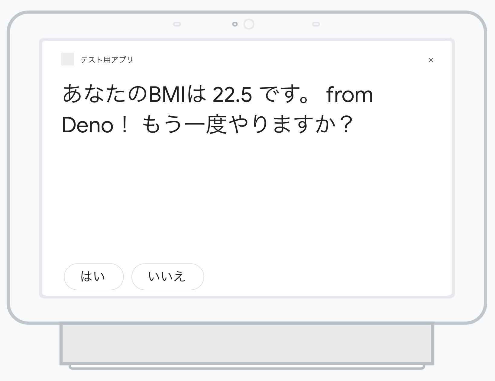

### まとめ
いかがでしたでしょうか？Actions Builderという新しいIDEでActions On Googleのアクションを作ってみませんか？今まではDialogflowほぼ一択でしたが、シーンという概念で圧倒的にコード量を減らすことができます。面白いアクションを是非作ってみてはいかがでしょうか？