### 2-1. Agentを作成する

[https://dialogflow.cloud.google.com/](https://dialogflow.cloud.google.com/) にアクセスしてください。
［Sign up for free］ボタンをクリックします。お持ちのGoogleアカウントでログインしてください。

初めてDialogflowをお使いになる方は利用許可してください。

Terms of Service部分のチェックを入れてから［ACCEPT］ボタンをクリックします。

［CREATE AGENT］ボタンをクリックします。

`HelloDeno` と入力し、デフォルト言語を `Japanese - ja` に選択してから［CREATE］ボタンをクリックします。

### 2-2. オウム返しをしよう
`Default Fallback Intent` をクリックします。

 `Fulfillment` カテゴリにある 「Enable webhook call for this intent」を有効化にします。
これで応答をWebhook経由で返すことができます。

左側メニューの `Fulfillment` をクリックします。Webhookカテゴリを有効化にします。（※2つあるので、上側のWebhookを有効化にします）
Webhook URLは下記URLを貼り付けてください。

`https://[[HOST_SUBDOMAIN]]-3000-[[KATACODA_HOST]].environments.katacoda.com/`{{copy}}

`hello.ts` を開いて、下記プログラムをコピペしてください。

<pre class="file" data-target="clipboard">
import { Application, Context } from "https://deno.land/x/abc@v1.0.0-rc10/mod.ts";
const app = new Application();

app.post('/', async (ctx: Context) => {
    const {queryResult} = await (ctx.body());

    let js = {
            fulfillmentText: `Denoから「${queryResult.queryText}」`
    }

    await ctx.json(js);

});

// ポート開く
app.start({port: 3000});
</pre>

下記コマンドを実行します。

`deno run --allow-net hello.ts`{{execute}}

画面右側の `Try it now` 部分に好きな言葉を入力してください。
すると `Denoから「XXXXXX」` と入力した言葉が返ってきます。

### 2-3. 特定の言葉に反応させよう
新規Intent作成して特定の言葉に反応するAPIも作成しましょう。左側メニューの `Intents` にある［＋］ボタンをクリックしてください。Intent名は `MorningIntent` と入力します。こちらはスペルミスに気をつけてください。 Training phrasesカテゴリ部分に「おはよう」と入力して Enterキーを押して確定してください。
Fulfillmentカテゴリにある `Enable webhook call for this intent` を有効化にしておきます。
設定できたら右上にある［SAVE］をクリックします。

次にプログラムを編集します。すでに書いているプログラムを消してから、下記プログラムをhello.tsにコピペしてください。

<pre class="file" data-target="clipboard">
import { Application, Context } from "https://deno.land/x/abc@v1.0.0-rc10/mod.ts";
const app = new Application();

app.post('/', async (ctx: Context) => {
    const {queryResult} = await (ctx.body());

    // Intent名取得
    const displayName = queryResult.intent.displayName;
    let js = {};

    // MorningIntentかどうか判別
    if (displayName === 'MorningIntent') {
        js = {
            fulfillmentText: `😃おはようございます😃`
        };
    } else {
        js = {
            fulfillmentText: `Denoから「${queryResult.queryText}」`
        };
    }
    await ctx.json(js);
})

// ポート開く
app.start({port: 3000});
</pre>

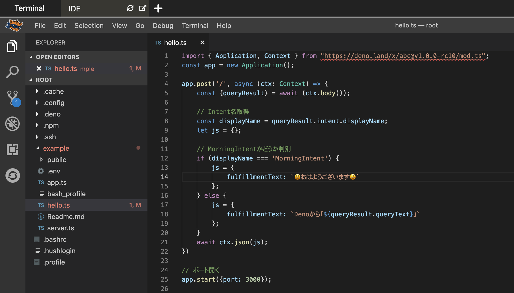

Step2-2のプログラムが動いているので、下記コマンドで一度プログラムを止めておきます。

<kbd>Ctrl</kbd>+<kbd>C</kbd>
`echo "プログラム停止"`{{execute interrupt}}

再度コマンドを実行します。

`deno run --allow-net hello.ts`{{execute}}

これでDialogflowの Try it now で「おはよう」と入力すると、Denoを経由して「😃おはようございます😃」と返ってきます。

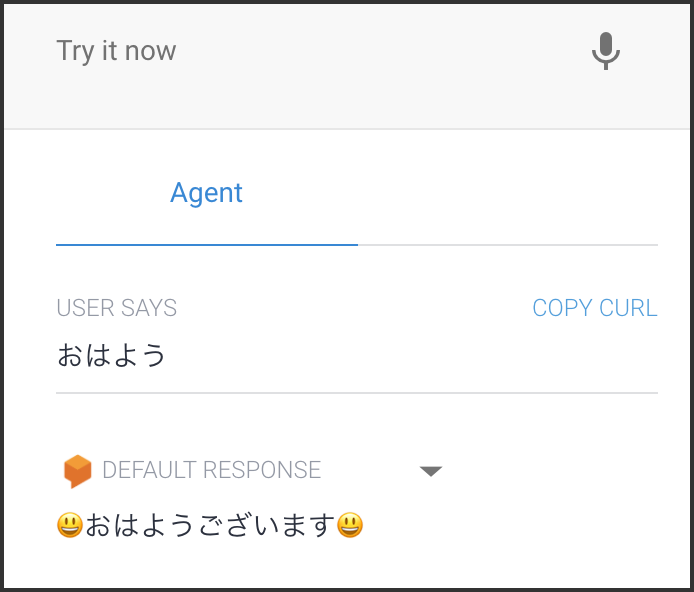

### 2-4. パラメーターの受け取り
新規Intentを作成します。［＋］をクリックして、Intent名を `NameIntent` とします。Tranining phrasesに「スタート」と入力してください。

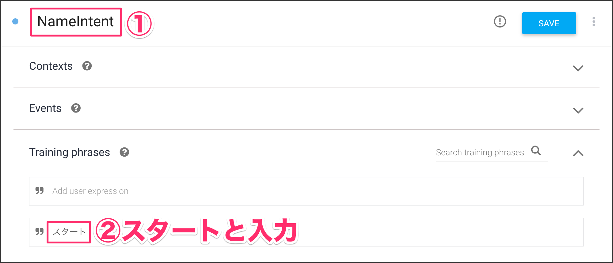

Action and parametersカテゴリの項目を埋めていきます。

|項目|値|
|:--|:--|
|REQUIRED| チェックを入れる|
|PARAMETER NAME|name|
|ENTITY|@sys.any|
|VALUE|$name|
|PROMPTS| Define prompts をクリック|

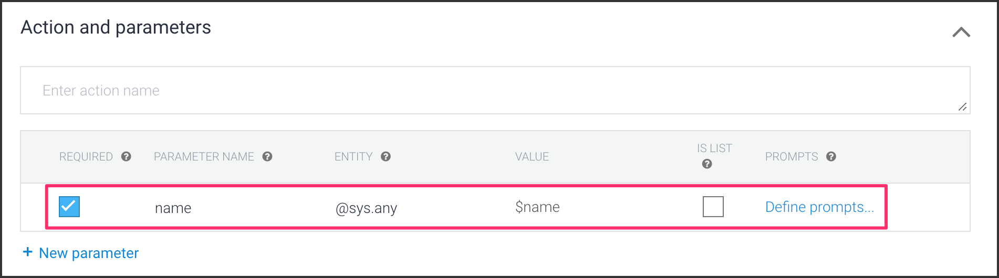

Define promptsをクリックして、「君の名前は？」と入力します。これで「スタート」と入力した後に「君の名前は？」とDialogflow側から聞かれるようになります。

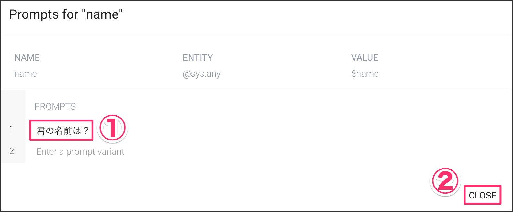

Fulfillmentカテゴリにある `Enable webhook call for this intent` を有効化にしておきます。
設定できたら右上にある［SAVE］をクリックします。

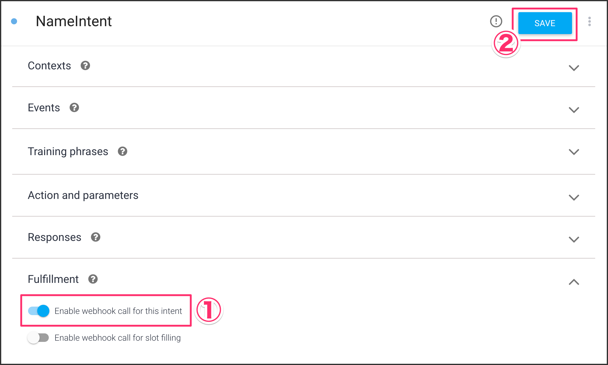

下記プログラムを hello.tsファイルにコピペしてください。（※既存のプログラムに上書きします）
`queryResult.parameters.name` にDialogflowから送られてくるパラメーターを取得することができます。

<pre class="file" data-target="clipboard">
import { Application, Context } from "https://deno.land/x/abc@v1.0.0-rc10/mod.ts";
const app = new Application();

app.post('/', async (ctx: Context) => {
    const {queryResult} = await (ctx.body());
    const displayName = queryResult.intent.displayName;
    let js = {};

    if (displayName === 'MorningIntent') {
        js = {
            fulfillmentText: `😃おはようございます😃`
        };
    } else if (displayName === 'NameIntent') {
        js = {
            fulfillmentText: `あなたの名前は「${queryResult.parameters.name}」ですね！`
        };
    } else {
        js = {
            fulfillmentText: `Denoから「${queryResult.queryText}」`
        };
    }
    await ctx.json(js);
});

// ポート開く
app.start({port: 3000});
</pre>

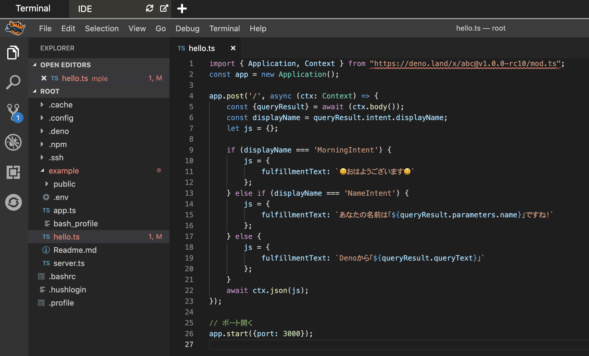

<kbd>Ctrl</kbd>+<kbd>C</kbd>
`echo "プログラム停止"`{{execute interrupt}}

再度コマンドを実行します。

`deno run --allow-net hello.ts`{{execute}}

これで Try it now に「スタート」と入力すると「君の名前は？」と聞き返されるので、名前を入力します。

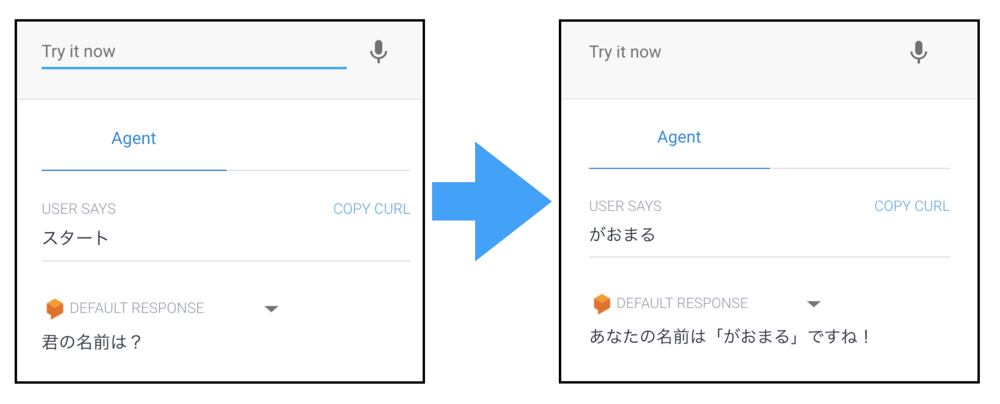

### 2-5. Dialogflow Messengerに対応する
Dialogflow Messengerとは運営しているWebサイトに対してチャットボット機能を簡単に導入することができる機能です。
よくあるQ&Aのチャットシステムと考えてもらえれば良いと思います。

左側メニューの `Integrations` をクリックして表示される、 `Dialogflow Messenger` を有効化にします。

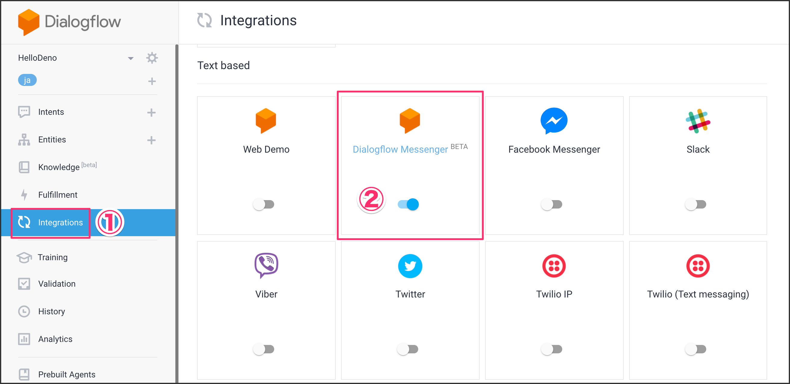

ポップアップが表示されるので、そこに書かれているコードをコピーしておきます。

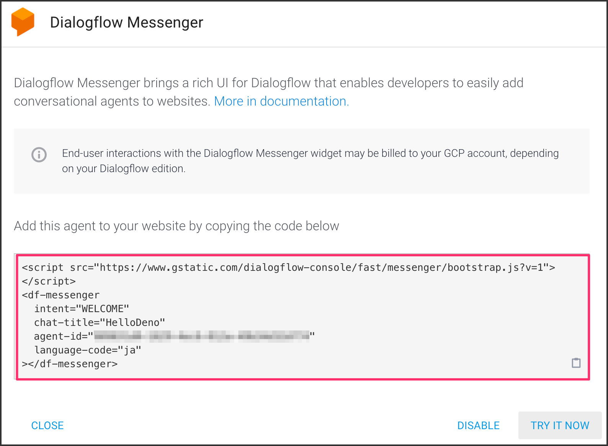

コピーしたコードを `example/public/index.html` の </body>タグ直前ぐらいに貼り付けます。

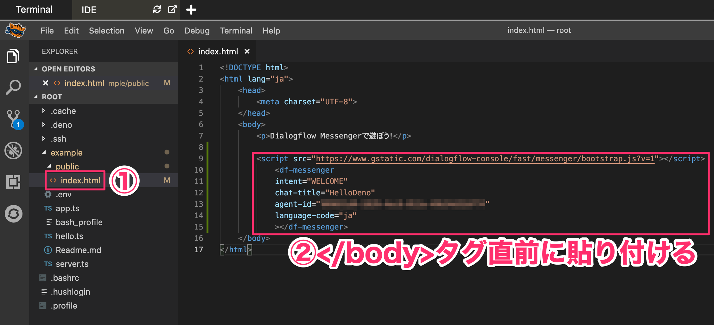

プログラムを少し改変します。下記コードを `hello.ts` ファイルにコピペします。

<pre class="file" data-target="clipboard">
import { Application, Context } from "https://deno.land/x/abc@v1.0.0-rc10/mod.ts";
const app = new Application();

app.static('/', './public');

// htmlファイルを読み込む
app.get('/', async (ctx: Context) => {
    await ctx.file('./public/index.html');
});

app.post('/', async (ctx: Context) => {
    const {queryResult} = await (ctx.body());
    const displayName = queryResult.intent.displayName;
    let js = {};

    if (displayName === 'MorningIntent') {
        js = {
            fulfillmentText: `😃おはようございます😃`
        };
    } else if (displayName === 'NameIntent') {
        js = {
            fulfillmentText: `あなたの名前は「${queryResult.parameters.name}」ですね！`
        };
    } else {
        js = {
            fulfillmentText: `Denoから「${queryResult.queryText}」`
        };
    }
    await ctx.json(js);
});

// ポート開く
app.start({port: 3000});
</pre>

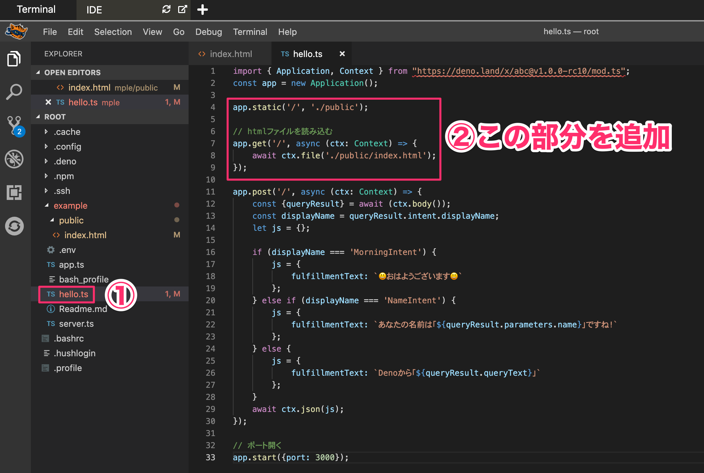

<kbd>Ctrl</kbd>+<kbd>C</kbd>
`echo "プログラム停止"`{{execute interrupt}}

再度コマンドを実行します。今度はhtmlファイルを読み取る必要があるので `--allow-read` の権限を付与して実行しています。

`deno run --allow-net --allow-read hello.ts`{{execute}}

下記URLにアクセスすると画面右下にDialogflowのロゴが表示されるので、クリックすると Try it now と同様に、入力した結果が返ってきます。

https://[[HOST_SUBDOMAIN]]-3000-[[KATACODA_HOST]].environments.katacoda.com/

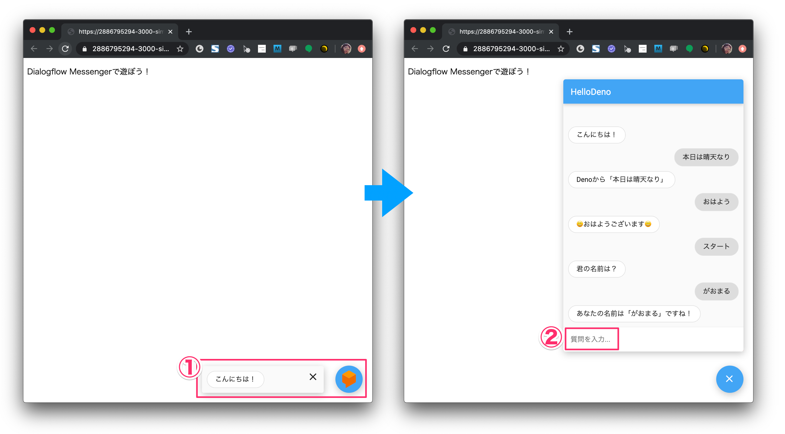
