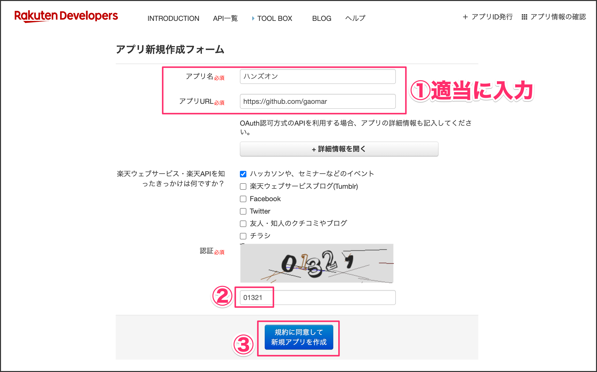
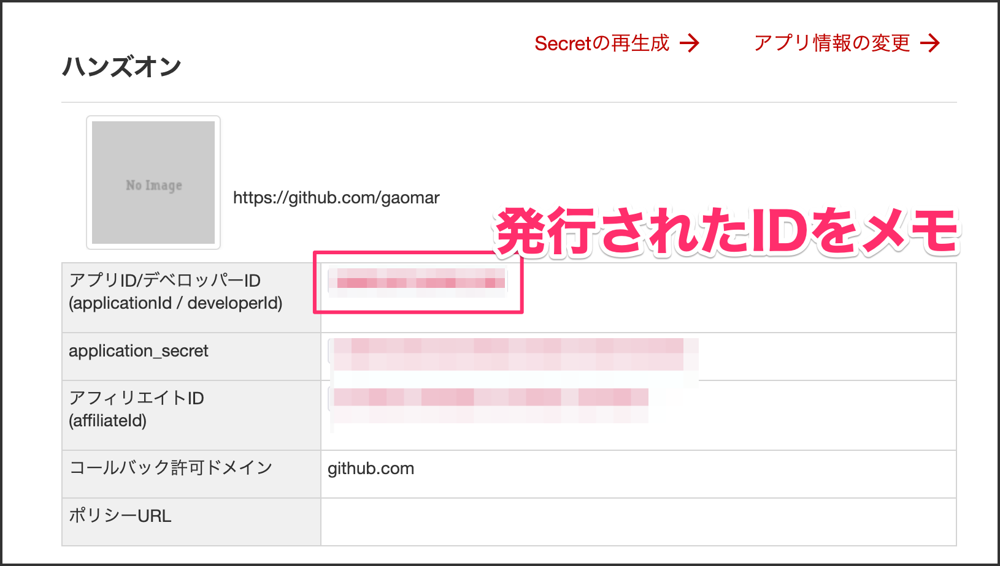
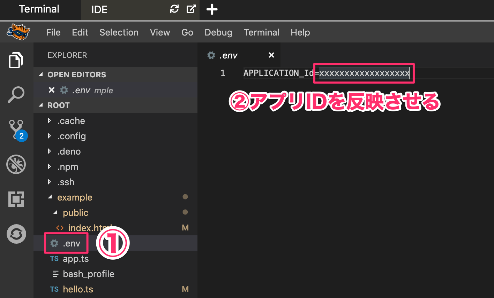
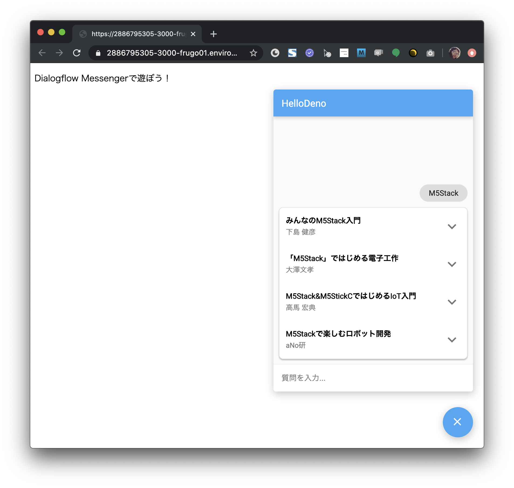

### 3-1. 楽天APIアプリIDを発行する
楽天APIを使って書籍の検索を行います。下記URLをクリックして、お持ちの楽天IDでログインしてください。

[https://webservice.rakuten.co.jp/app/create](https://webservice.rakuten.co.jp/app/create)

アプリ名、アプリURLを入力します。アプリURLはご自身のGitHubのURLでも良いですし、お好きなURLを指定してください。なんでも構いません。
（※すでに登録されている方は発行する必要はありません）

発行されたアプリID/デベロッパーIDをメモしておきます。

### 3-2. .envファイルに反映させる
`example/.env` ファイルを開いて先程発行したアプリIDを貼り付けてください。

### 3-3. 動作確認

Step2-5のプログラムが動いているので、下記コマンドで一度プログラムを止めておきます。

<kbd>Ctrl</kbd>+<kbd>C</kbd>
`echo "プログラム停止"`{{execute interrupt}}

下記プログラムを実行します。今回は `--allow-env` 権限を追加しています。 `.env` ファイルの値を読み取るために dotenvのモジュールを使っているためです。

`deno run --allow-net --allow-read --allow-env app.ts`{{execute}}

下記URLにアクセスして、お好きな本のタイトルを入力してみてください。楽天APIを経由して結果が返ってきます。

https://[[HOST_SUBDOMAIN]]-3000-[[KATACODA_HOST]].environments.katacoda.com/

### まとめ
Denoを使うと、今までにあったnode_moduleフォルダが無くなり、シンプルな構成で開発できると思います。まだ出たばかりなので、どんどんアップデートされていくことでしょう。
簡単な連携からスタートするのも良いと思いますので、色々試してみてください。
