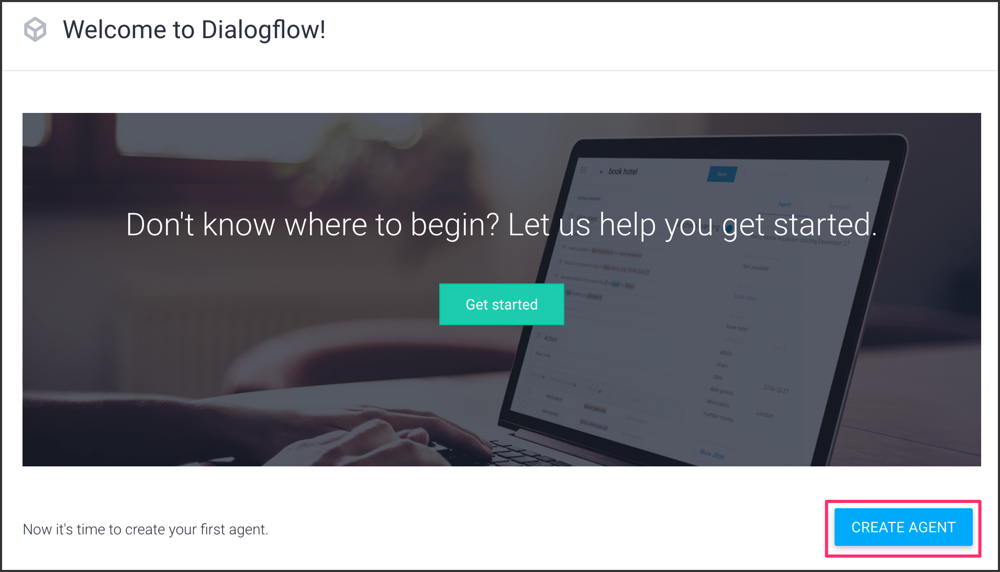

### 1-1. Agentを作成する

[https://dialogflow.com/](https://dialogflow.com/) にアクセスしてください。
［Sign up for free］ボタンをクリックします。お持ちのGoogleアカウントでログインしてください。

初めてDialogflowをお使いになる方は利用許可してください。

Terms of Service部分のチェックを入れてから［ACCEPT］ボタンをクリックします。

［CREATE AGENT］ボタンをクリックします。

`HelloDialogflowMessenger` と入力し、デフォルト言語を Japanese - ja に選択してから［CREATE］ボタンをクリックします。

### 1-2. Intentの設定

`Default Fallback Intent` をクリックします。

`Enable webhook call for this intent` のチェックを有効化にします。これでWebhookが有効化になりました。

### 1-3. Fulfillmentの設定

左側メニューから `Fulfillment` をクリックして、Webhookを有効化にします。2箇所あるので、上の方を有効化にします。

こちらのURLを貼り付けます。

`https://[[HOST_SUBDOMAIN]]-3000-[[KATACODA_HOST]].environments.katacoda.com/`{{copy}}

貼り付けたら［SAVE］ボタンをクリックします。

### 1-4. Dialogflow Messengerの設定
左側メニューから `Integrations` をクリックして、Dialogflow Messengerを有効化にします。

ポップアップが表示されるので、`agent-id` をメモしておきます。

これでDialogflow Messengerの準備は完了しました。