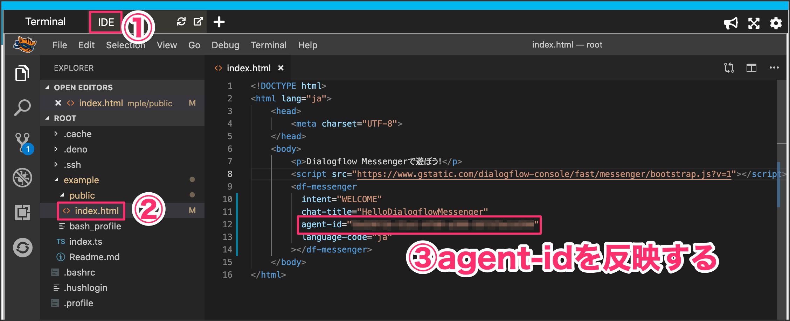
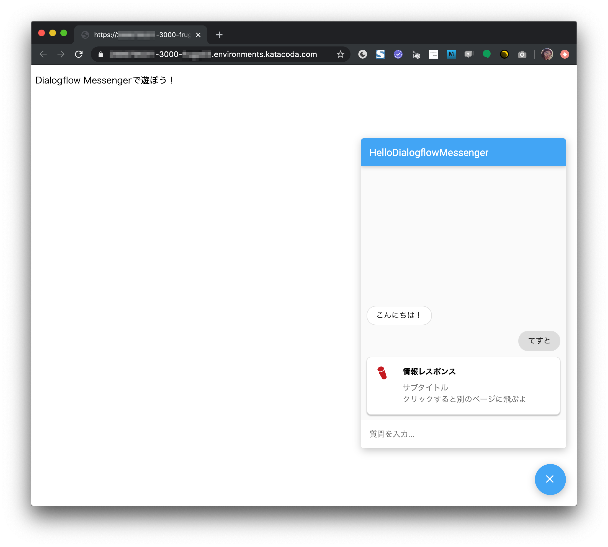
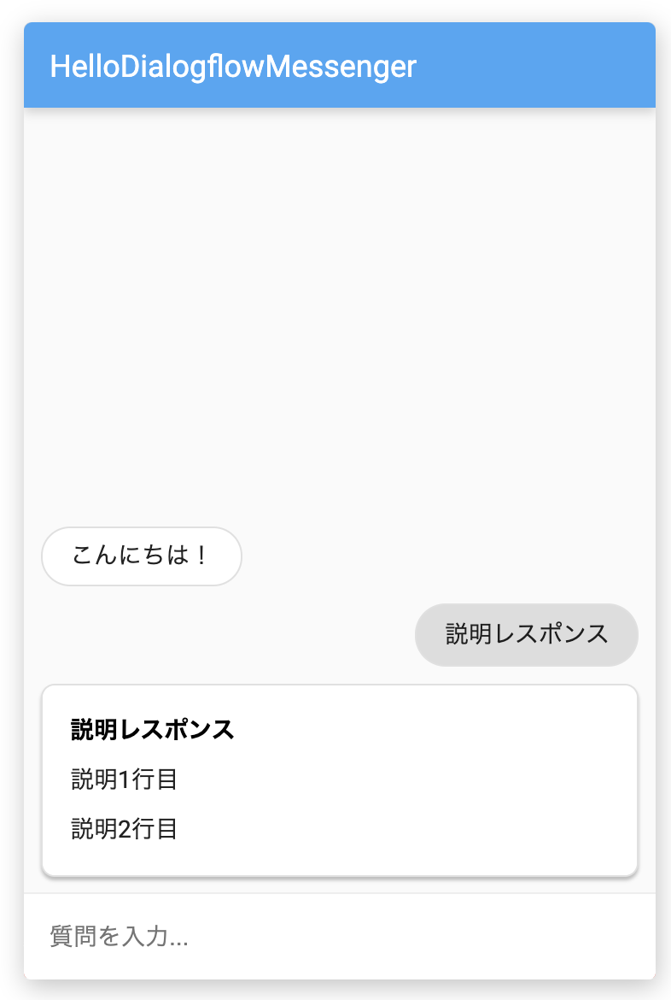
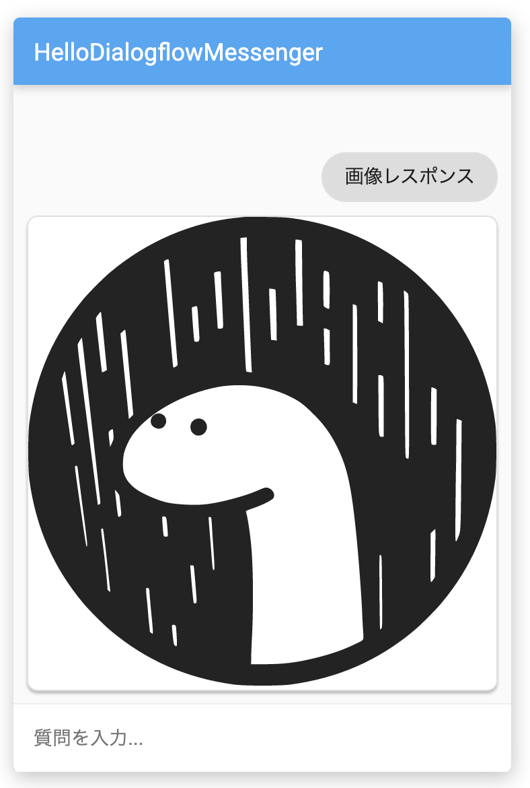
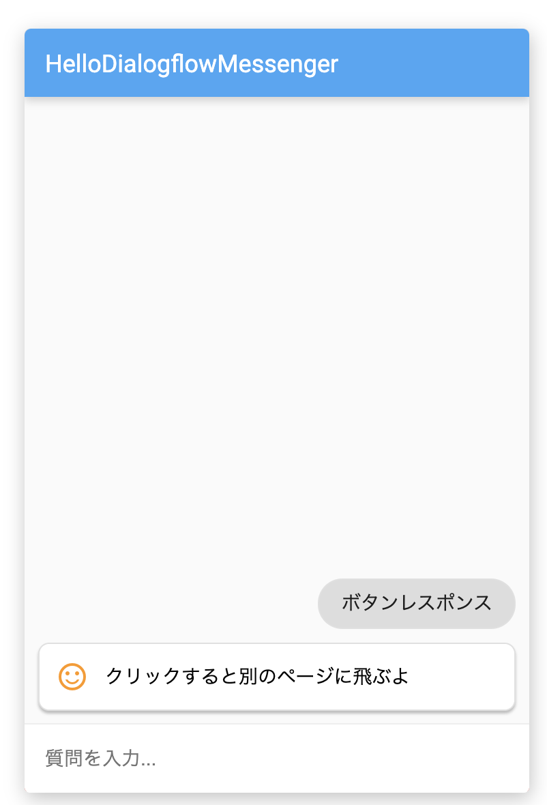
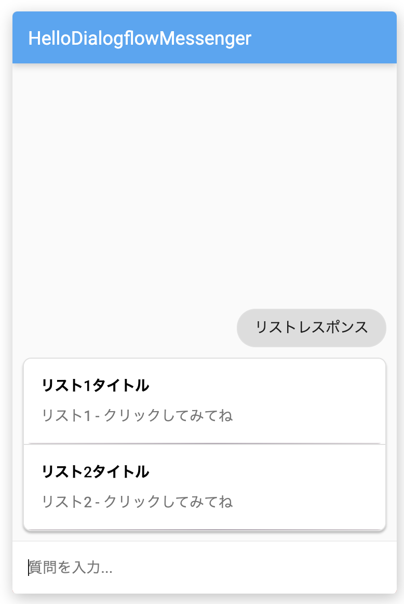
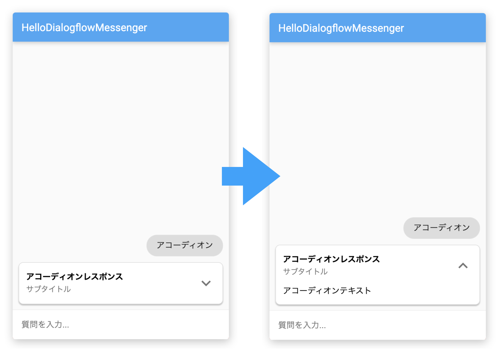
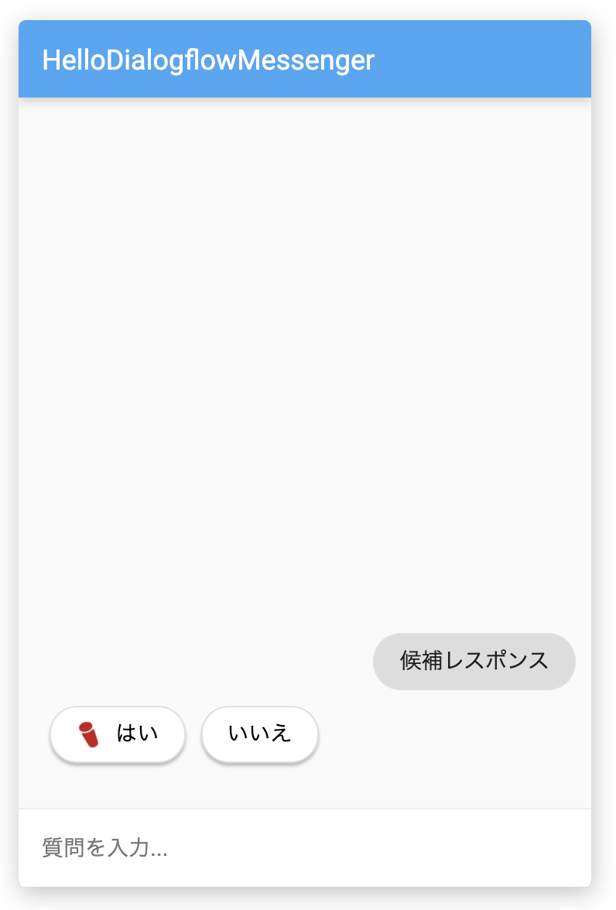
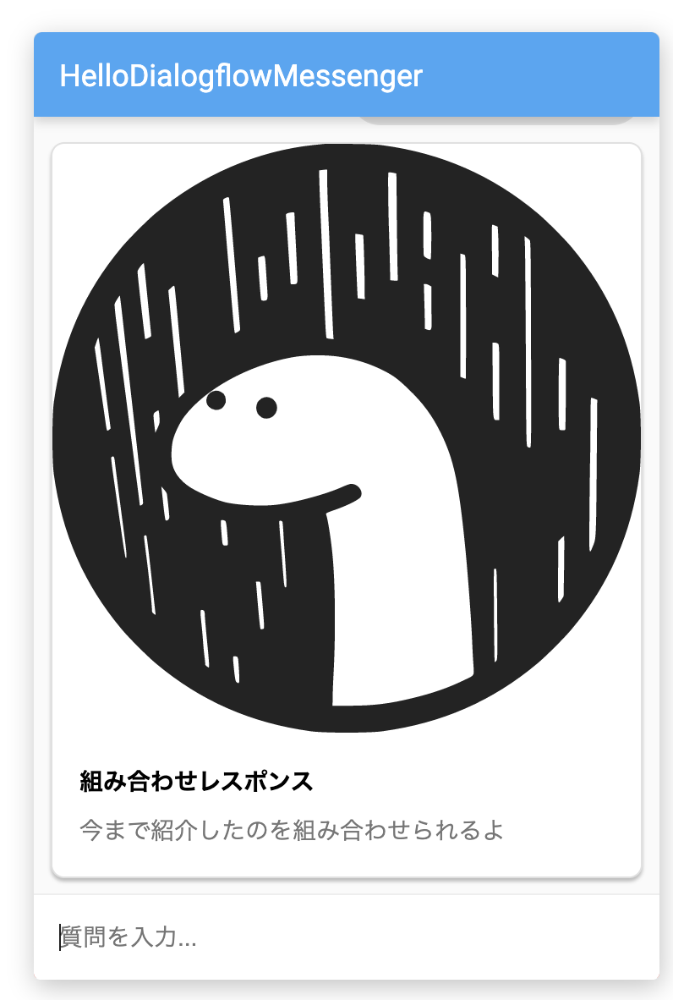

### 2-1. プログラムを編集する
IDEタブをクリックしてVSCodeを起動します。 `example/public/index.html` ファイルを開いてください。その中にある `agent-id` をStep1-4でメモした値に変更しておきます。

### 2-2. Denoを動かしてみよう
下記コマンドを実行してみよう

`deno run --allow-net --allow-read hello.ts`{{execute}}

下記URLにアクセスします。適当な言葉を入力するとレスポンスが返ってきます。

https://[[HOST_SUBDOMAIN]]-3000-[[KATACODA_HOST]].environments.katacoda.com/

他のレスポンスを試す方は、下記コマンドで一度プログラムを止めてください。

<kbd>Ctrl</kbd>+<kbd>C</kbd>
`echo "プログラム停止"`{{execute interrupt}}

### 2-3. 他のレスポンスを試す

VSCodeの `example/hello.ts` ファイルを開いてください。
12行目で定義している `js` 変数に返したいレスポンスのjsonを設定します。

編集したら再度下記コマンドを実行して確認してみましょう。

`deno run --allow-net --allow-read hello.ts`{{execute}}

### 説明レスポンス
一般的なタイトルと内容を明記するものです。

<pre class="file" data-target="clipboard">
js = {
    "fulfillmentMessages": [
        {
            "payload": {
                "richContent": [
                    [
                        {
                        "type": "description",
                        "title": "説明レスポンス",
                        "text": [
                            "説明1行目",
                            "説明2行目"
                        ]
                        }
                    ]
                ]
            }
        }
    ]
}
</pre>

### 画像レスポンス
画像を返してくれます。svgファイル以外にもjpeg、png画像なども可能です。

<pre class="file" data-target="clipboard">
js = {
    "fulfillmentMessages": [
        {
            "payload": {
                "richContent": [
                    [
                        {
                        "type": "image",
                        "rawUrl": "https://deno.land/logo.svg",
                        "accessibilityText": "Deno logo"
                        }
                    ]
                ]
            }
        }
    ]
}
</pre>

### ボタンレスポンス
クリックすると、別のWebページに遷移させることができます。また `event` を使うことで、別途パラメータを渡すこともできます。

<pre class="file" data-target="clipboard">
js = {
    "fulfillmentMessages": [
        {
            "payload": {
                "richContent": [
                    [
                        {
                            "type": "button",
                            "icon": {
                                "type": "sentiment_satisfied_alt", // 何も指定しなければ矢印アイコン
                                "color": "#FF9800"
                            },
                            "text": "クリックすると別のページに飛ぶよ",
                            "link": "https://www.i-enter.co.jp",
                            "event": {
                                "name": "RESULT",
                                "languageCode": "ja-JP",
                                "parameters": {
                                    "hoge": "ボタンクリック"
                                }
                            }
                        }
                    ]
                ]
            }
        }
    ]
}
</pre>

### リストレスポンス
検索結果などを表示するのに適しているものです。 `divider` を使うことで区切り線をつけることができます。クリックで反応することができます。 `event` にも対応しています。

<pre class="file" data-target="clipboard">
js = {
    "fulfillmentMessages": [
        {
            "payload": {
                "richContent": [
                    [
                        {
                            "type": "list",
                            "title": "リスト1タイトル",
                            "subtitle": "リスト1 - クリックしてみてね",
                            "event": {
                                "name": "RESULT",
                                "languageCode": "ja-JP",
                                "parameters": {
                                    "hoge": "リスト1をクリック"
                                }
                            }
                        },
                        {
                            "type": "divider"
                        },
                        {
                            "type": "list",
                            "title": "リスト2タイトル",
                            "subtitle": "リスト2 - クリックしてみてね",
                            "event": {
                                "name": "RESULT",
                                "languageCode": "ja-JP",
                                "parameters": {
                                    "hoge": "リスト2をクリック"
                                }
                            }
                        }
                    ]
                ]
            }
        }
    ]
}
</pre>

### アコーディオン
クリックすると、メニューが展開されます。

<pre class="file" data-target="clipboard">
js = {
    "fulfillmentMessages": [
        {
            "payload": {
                "richContent": [
                    [
                        {
                            "type": "accordion",
                            "title": "アコーディオンレスポンス",
                            "subtitle": "サブタイトル",
                            "text": "アコーディオンテキスト"
                        }
                    ]
                ]
            }
        }
    ]
}
</pre>

### 候補ワードレスポンス
押してほしい候補をボタンで返してくれます。 `image` を指定するとボタンアイコンを設定することができます。

<pre class="file" data-target="clipboard">
js = {
    "fulfillmentMessages": [
        {
            "payload": {
                "richContent": [
                    [
                        {
                            "type": "chips",
                            "options": [
                                {
                                    "text": "はい",
                                    "image": {
                                        "src": {
                                            "rawUrl": "https://www.i-enter.co.jp/images/favicon.ico"
                                        }
                                    }
                                },
                                {
                                    "text": "いいえ"
                                }
                            ],
                        }
                    ]
                ]
            }
        }
    ]
}
</pre>

### 組み合わせレスポンス
これまでに紹介したものを組み合わせることができます。

<pre class="file" data-target="clipboard">
js = {
    "fulfillmentMessages": [
        {
            "payload": {
                "richContent": [
                    [
                        {
                            "type": "image",
                            "rawUrl": "https://deno.land/logo.svg",
                            "accessibilityText": "Denoイメージ"
                        },
                        {
                            "type": "info",
                            "title": "組み合わせレスポンス",
                            "subtitle": "今まで紹介したのを組み合わせられるよ",
                            "actionLink": "https://cloud.google.com/dialogflow/docs/integrations/dialogflow-messenger#info_response_type"
                        }
                    ]
                ]
            }
        }
    ]
}
</pre>

