### 1-1. 新規チャネルを作成する
LINE DeveloperページへアクセスしてLINEログインしてください。
[https://developers.line.biz/ja/](https://developers.line.biz/ja/)

まだプロバイダー設定してない方はお好きな名前でプロバイダー名を設定してください。
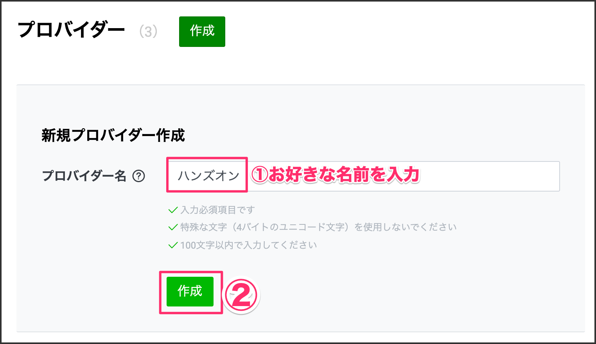

新規チャネルをクリックします。
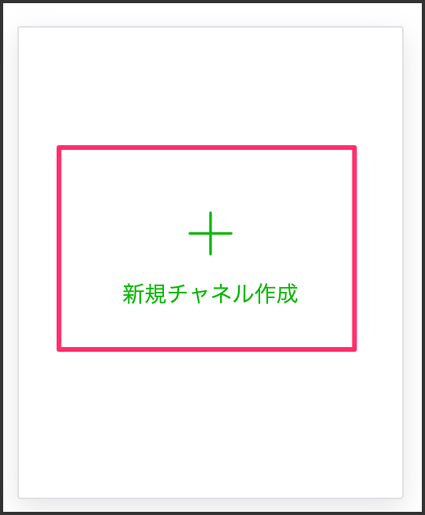

真ん中の `Messaging API` をクリックします。

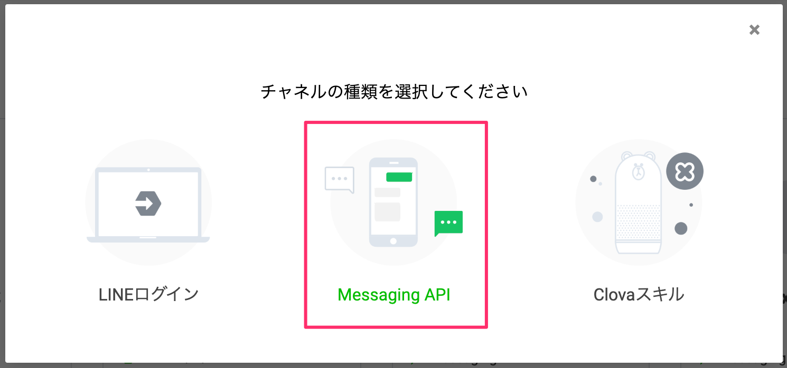

それぞれの項目を設定します。

各種項目を埋めていきます。

|項目|値|
|:--|:--|
|①チャネル名|M5StickCビーコン|
|②チャネル説明|M5StickCビーコン|
|③大業種|個人|
|④小業種|個人（その他）|
|⑤メールアドレス|あなたのメールアドレスを入力してください|

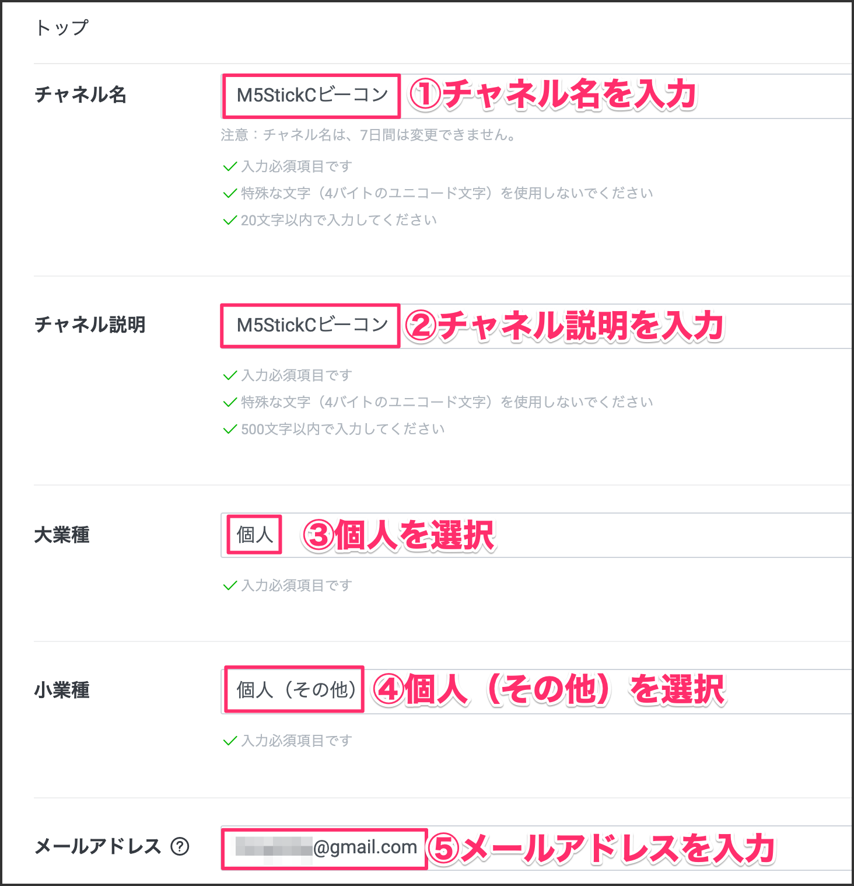

2つチェックを入れて、［作成］ボタンをクリックします。
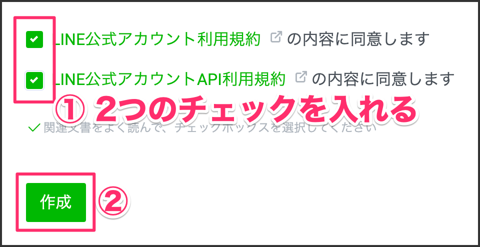

［同意する］ボタンをクリックします。
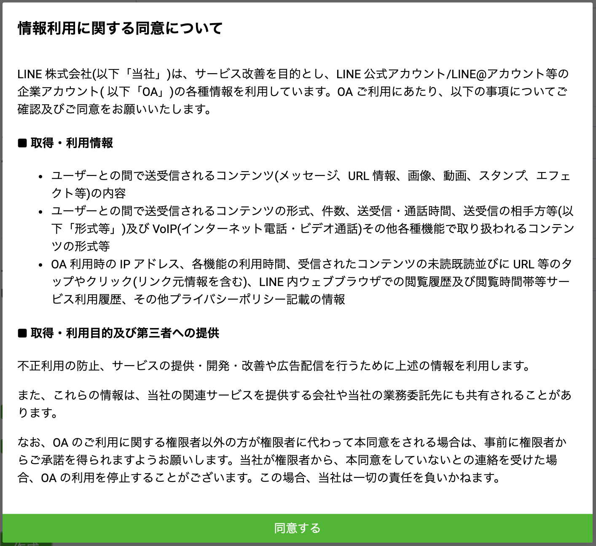

### 1-2. チャネルシークレットをメモする
下の方にスクロールすると「チャネルシークレット」という部分があるので、その値をメモしておきます。

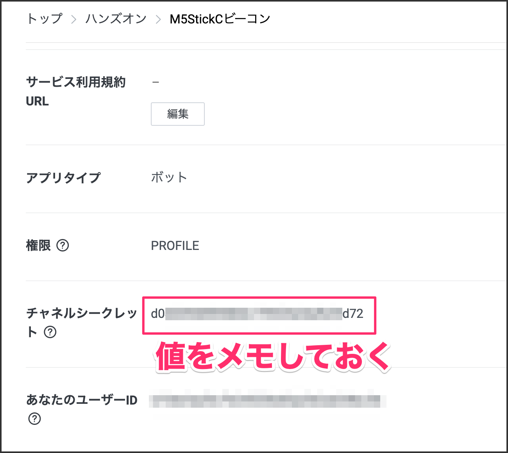

### 1-3. Botと友だちになる
作成したBotと友だちになっておきます。QRコードを読み取って友だちになります。

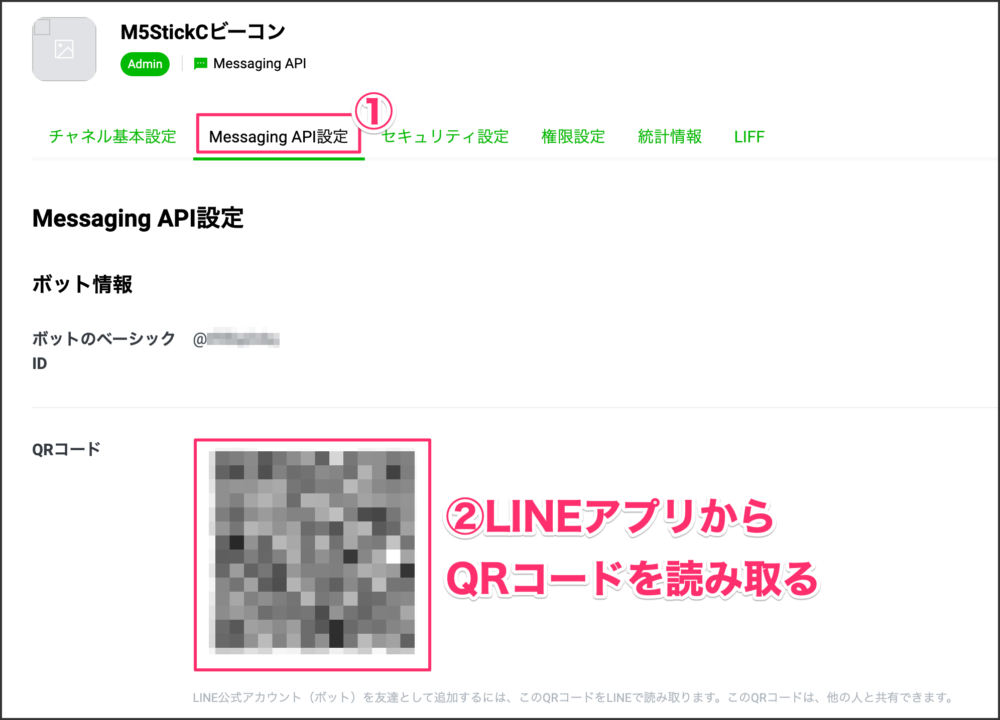

［追加］ボタンをクリックします。
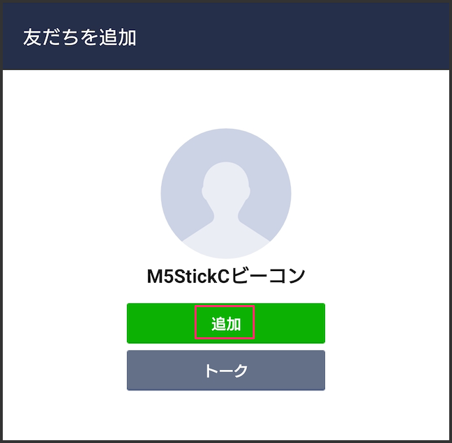

### 1-4. チャネルアクセストークンをメモする
下の方にスクロールすると「チャネルアクセストークン」という部分があるので、［発行］ボタンをクリックして、アクセストークンを発行します。発行されたトークンは後ほど使うので、メモしておきます。

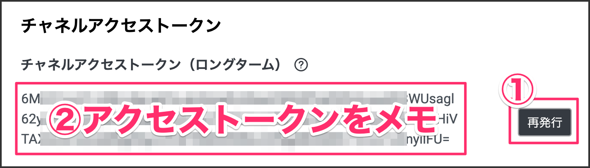

### 1-5. WebhookのURLを設定する
下記URLを追加して［更新］ボタンをクリックします。更新するとWebhookの利用部分が表示されるので、有効にしておきます。

```
https://[[HOST_SUBDOMAIN]]-3000-[[KATACODA_HOST]].environments.katacoda.com/linebot
```


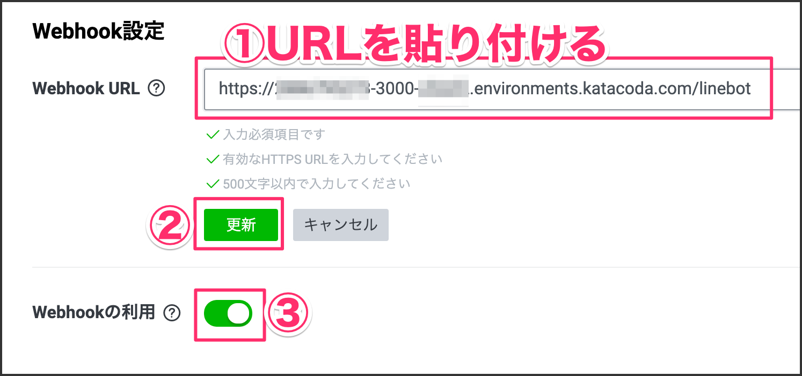

### 1-6. LINE公式アカウントを設定する
Botの応答メッセージを無効にしたいので設定を行います。［編集］部分をクリックします。

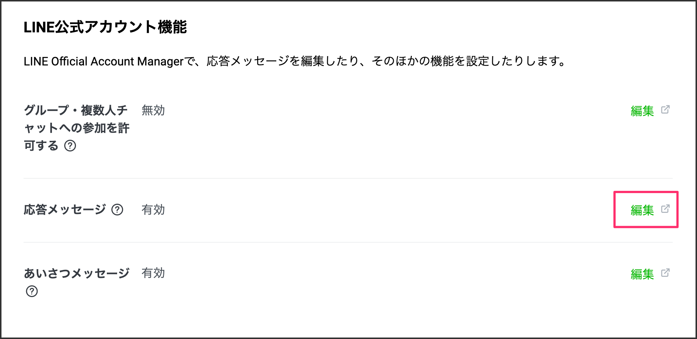

ここをオフにしておく。

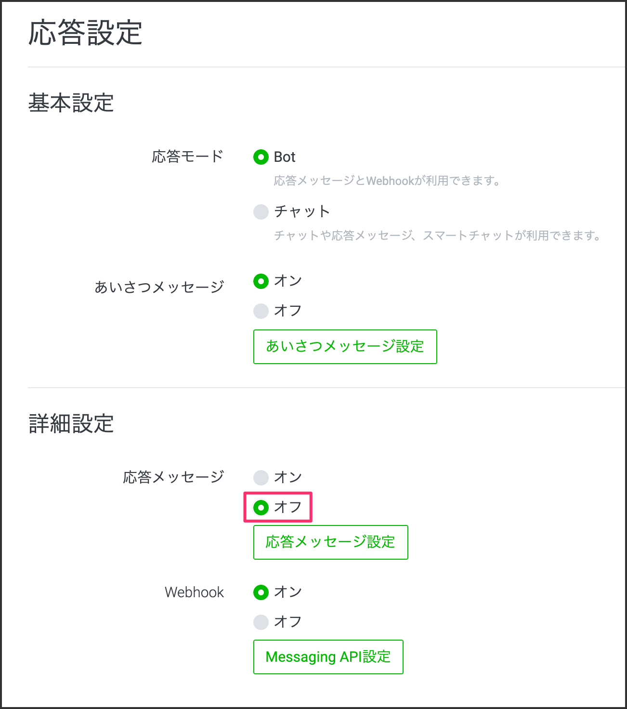

以上でLINE Botの設定は完了です。